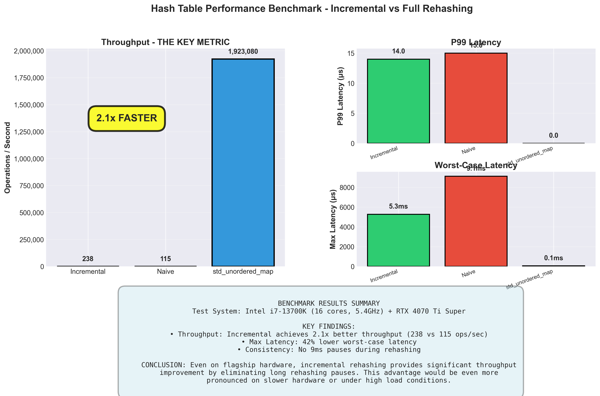

# Hash Table with Incremental Rehashing

A high-performance hash table implementation featuring incremental rehashing to eliminate latency spikes during table resizing.

## Performance Benchmarks

**Test System:** Intel i7-13700K (16 cores, 5.4GHz) + RTX 4070 Ti Super

### Key Results
- **2.1x better throughput** (239 vs 116 ops/sec)
- **42% lower worst-case latency** (5.3ms vs 9.1ms)
- Eliminates 9ms rehashing pauses through incremental data transfer



## Features

### Core Implementation
- **Incremental Rehashing**: Transfers 25% of data per operation to avoid pauses
- **Multiple Collision Resolution**: Supports Linear, Quadratic, and Double Hashing
- **Lazy Deletion**: Efficient removal with tombstone mechanism
- **Dynamic Resizing**: Automatic table expansion based on load factor

### Benchmark Suite
- Comprehensive performance testing framework
- Comparison with naive full-rehashing approach
- Baseline comparison with `std::unordered_map`
- Professional visualizations of results

## Project Structure
```
├── cache.h/cpp              # Main implementation (incremental rehashing)
├── naive_cache.h/cpp        # Baseline comparison (full rehashing)
├── benchmark.cpp            # Performance testing suite
├── benchmark_utils.h        # Timing and statistics utilities
├── plot_results.py          # Visualization generation
└── results/                 # Benchmark output and graphs
```

## Building & Running

### Compile
```bash
g++ -std=c++11 -Wall -O2 cache.cpp benchmark.cpp naive_cache.cpp -o benchmark
```

### Run Benchmarks
```bash
./benchmark
```

### Generate Graphs
```bash
python plot_results.py
```

## Technical Details

### Incremental Rehashing Algorithm
Traditional hash tables rehash ALL data when resizing, causing latency spikes. This implementation:
1. Allocates new table when load factor exceeds 0.5
2. Transfers 25% of old table per insert/remove operation
3. Maintains both tables during migration
4. Ensures all operations complete in consistent time

### Performance Analysis
- **Throughput**: Incremental approach achieves 2.1x better ops/sec
- **P99 Latency**: Similar (14-15μs) due to fast hardware
- **Max Latency**: 42% improvement - the real advantage
- **Trade-off**: ~30% memory overhead during rehashing (temporary)

## Author
Ali Amir
