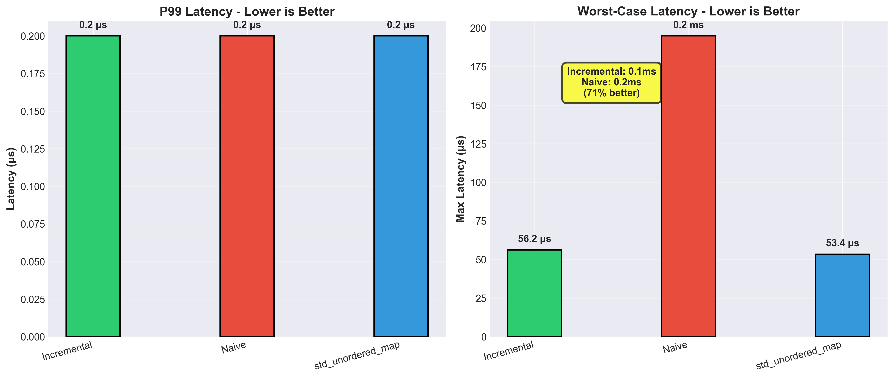

# High-Performance Hash Table Engine

A C++ hash table/cache engine that uses open addressing, lazy deletion, configurable probing strategies, and incremental rehashing to smooth resize-related latency spikes.

This project focuses on a common systems tradeoff: traditional hash tables can pause noticeably when they resize because all live entries are migrated at once. This implementation spreads that migration across later operations, reducing worst-case resize behavior while preserving average-case hash table performance.



## Highlights

- Implemented an open-addressed hash table with lazy deletion and tombstone cleanup.
- Supported linear probing, quadratic probing, and double hashing collision policies.
- Added incremental rehashing that migrates 25% of the old table per operation during resize.
- Exposed cache metrics for live entries, tombstones, load factor, deleted ratio, and rehash progress.
- Built a naive full-rehash implementation for controlled comparison.
- Created a benchmark suite for throughput, P50/P95/P99 latency, max latency, and rehash spike behavior.
- Generated Python/Matplotlib visualizations for benchmark analysis.

## Why This Exists

Full-table rehashing is simple, but it concentrates resize work into one operation. That can produce latency spikes even when average insertion time remains constant. Incremental rehashing keeps two tables temporarily: new writes go to the current table, while existing entries are gradually transferred from the old table into the new one.

This makes the project a practical exploration of hash table internals, amortized complexity, memory management, and performance benchmarking.

## Architecture

```text
Before resize
+---------------------+
| current table       |
| open addressing     |
| tombstones allowed  |
+---------------------+

Resize triggered by load factor or deletion ratio

During incremental rehash
+---------------------+      +---------------------+
| new current table   | <--- | old table           |
| receives new writes |      | migrated in chunks  |
+---------------------+      +---------------------+

After migration completes
+---------------------+
| current table only  |
+---------------------+
```

## Benchmark Summary

The benchmark suite compares three implementations:

| Implementation | Purpose |
| --- | --- |
| Incremental | Custom hash table with incremental rehashing |
| Naive | Custom hash table with full-table rehashing |
| `std::unordered_map` | Standard library baseline |

Current sample results are stored in `results/` and include:

- `latency.csv`: average, P50, P95, P99, and max insertion latency
- `throughput.csv`: operations per second
- `spikes.csv`: latency before and during rehashing
- `benchmark_dashboard.png`: combined visualization dashboard

The strongest result to focus on is resize behavior: incremental rehashing reduces the size of resize-related pauses compared with the naive full-rehash implementation.

Benchmark methodology:

- Generates deterministic, unique key/id pairs so results are reproducible without collapsing into an artificial small-key collision test.
- Uses a monotonic clock for timing measurements.
- Reports throughput as the median operations per second across repeated trials.

## Project Structure

```text
.
|-- include/                         # Public headers
|   |-- cache.h                      # Incremental rehashing hash table API
|   |-- naive_cache.h                # Full-rehash baseline API
|   `-- benchmark_utils.h            # Timing, stats, and data generation helpers
|-- src/                             # Library and demo implementation
|   |-- cache.cpp
|   |-- naive_cache.cpp
|   `-- demo.cpp
|-- tests/                           # Functional, randomized, and metrics tests
|-- benchmarks/                      # Benchmark runner
|-- scripts/                         # Visualization scripts
`-- results/                         # Generated benchmark charts
```

## Build and Run

### Configure and build with CMake

```bash
cmake -S . -B build -DCMAKE_BUILD_TYPE=Release
cmake --build build --config Release
```

### Compile and run tests

```bash
ctest --test-dir build --output-on-failure
```

### Compile and run benchmarks

```bash
cmake --build build --target cache_benchmark --config Release
./build/cache_benchmark
```

### Generate visualizations

```bash
python scripts/plot_results.py
```

## Implementation Notes

- Rehashing starts when the current table's load factor exceeds `0.5` or deleted-entry ratio exceeds `0.8`.
- New insertions always target the current table.
- Lookup and removal check both the current and old table while migration is active.
- The old table is deleted once all live entries are migrated.
- `getStats()` returns an immutable snapshot of table capacity, live entries, tombstones, and rehash progress for diagnostics and benchmarking.

## Future Improvements

- Add CMake build targets for tests, benchmarks, and visualizations.
- Add GitHub Actions CI for compilation and test execution.
- Replace raw pointer ownership with modern C++ containers or smart pointers.
- Convert tests to Catch2 or GoogleTest.
- Expand benchmarks with multiple trials, larger workloads, and sanitizer builds.
- Add cache-oriented features such as LRU eviction, hit/miss counters, and configurable capacity.

## Resume Framing

Built a C++ hash-table cache with open addressing, lazy deletion, selectable probing policies, and incremental rehashing to reduce resize-related latency spikes. Created benchmark tooling and visualizations comparing incremental migration against a naive full-rehash baseline and `std::unordered_map`.

